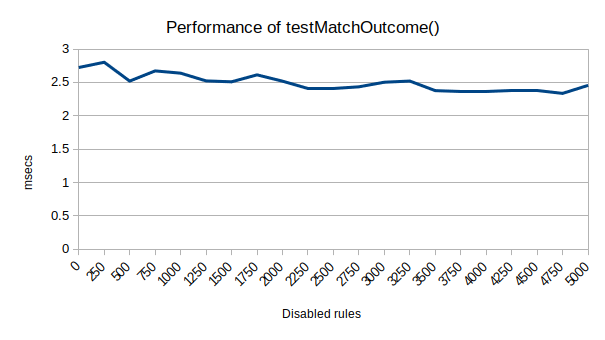

# Declarative Net Request: disable individual static rules (Extension to check testMatchOutcome performance with disabled rules)

The extension checks the testMatchOutcome() performance by changing the number of disabled rules in a static ruleset.

The static ruleset contains 20000 rules, The half of the rules (10000 rules) can be collected as the candidate rules for the test url. And all the candidate rules will not be matched.

This extension checks the testMatchOutcome() performance with different disabled rules:
(no disabled rules ~ 5000 disabled rules)

It checks the method call performance 30 times for each cases, and print the average result to the console.error

## How to use this extension

- Launch Chromium.
- Go to `More tools > Extensions`
- Click on `Load unpacked`
- Select the `extension` folder on this project.
- The output of the extension will be shown as log messages in the extension's `Errors` section.

## Test Result

(Local release build with [CL 3954955](https://crrev.com/c/3954955/9), [CL 3999643](https://crrev.com/c/3999643/3), [CL 3989814](https://crrev.com/c/3989814/7) and [CL 4005612](https://crrev.com/c/4005612/1))
